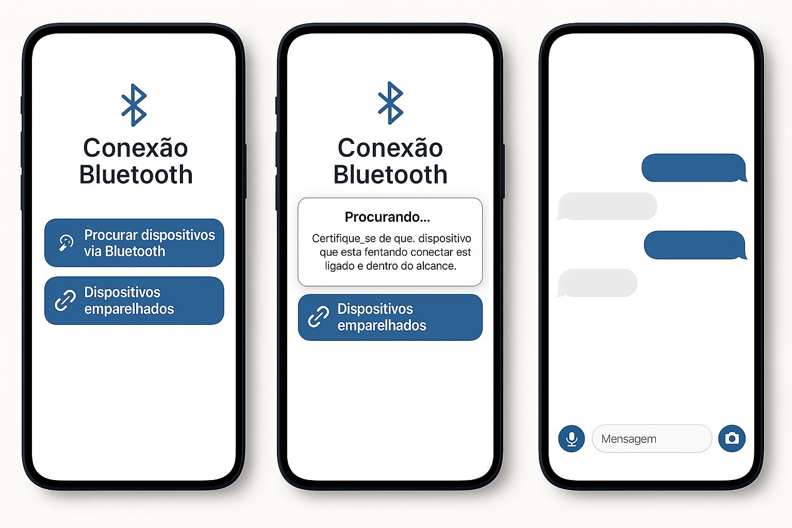
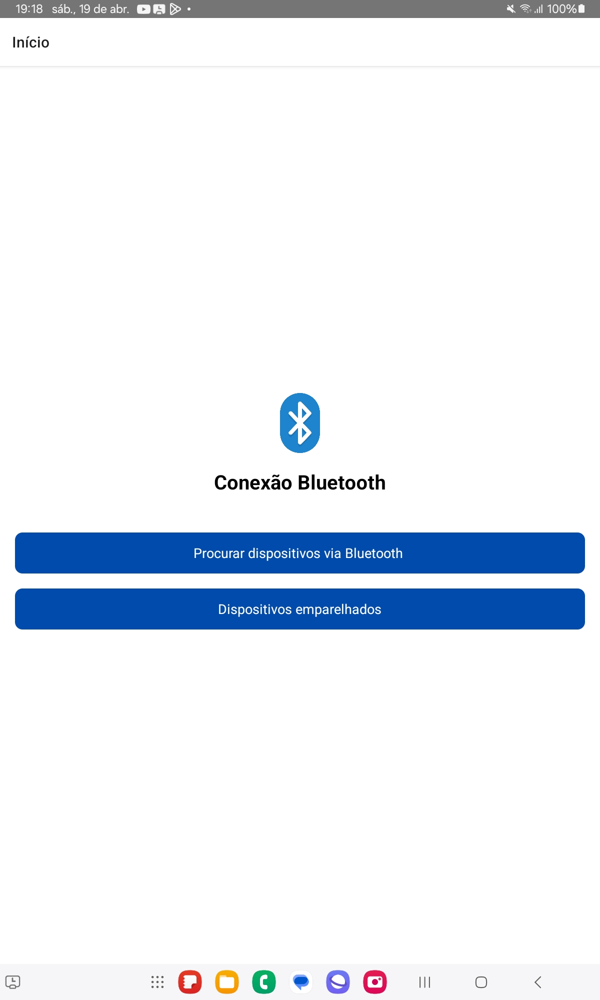
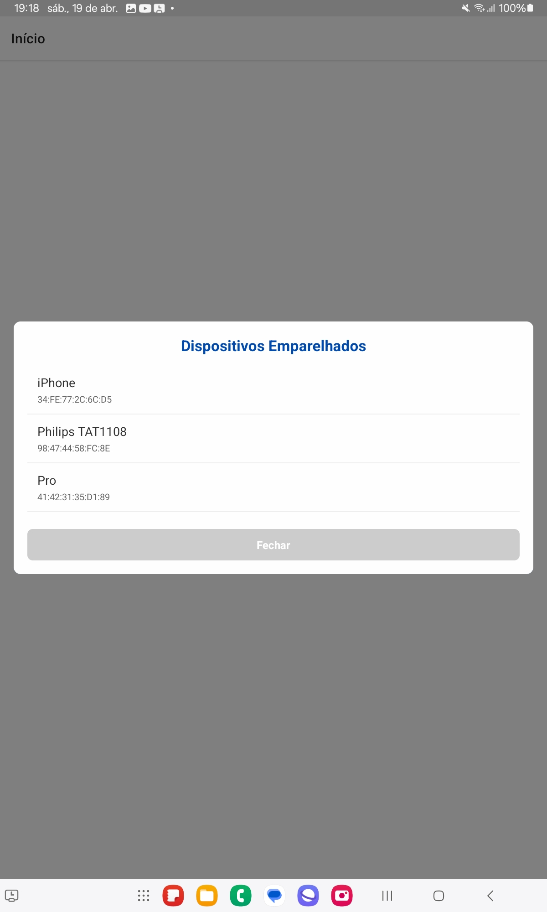
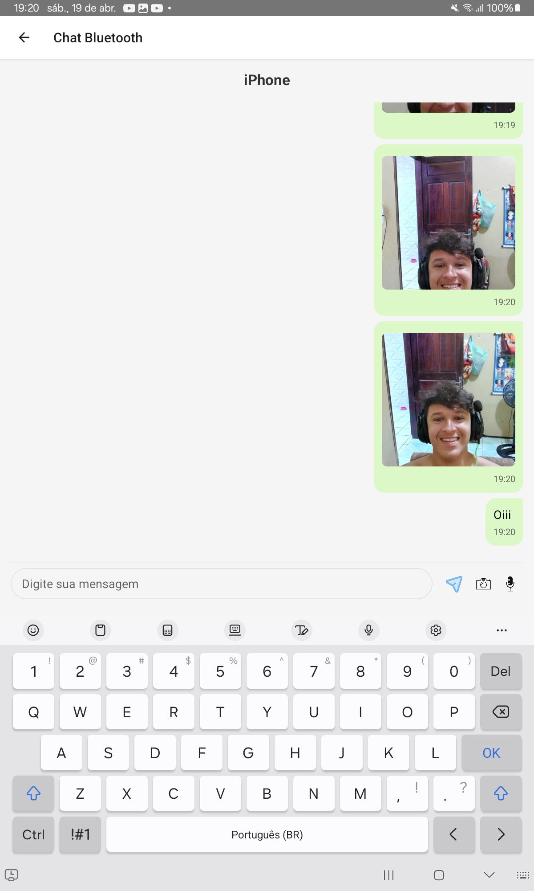

# 📱 Guia do Usuário - Chat Bluetooth App

Bem-vindo ao **Chat Bluetooth App**, um aplicativo de **mensagens locais entre dispositivos Android via Bluetooth**. Com ele, você pode **trocar mensagens de texto, enviar fotos da galeria ou da câmera, gravar áudios e reproduzi-los** — tudo isso **sem precisar de internet**!

---

## 🧭 O que você pode fazer com o app?

- Conectar com outro celular via Bluetooth
- Trocar mensagens de texto
- Enviar imagens da câmera ou galeria
- Gravar e enviar áudios
- Reproduzir áudios recebidos
- Acessar todo o histórico da conversa (mesmo ao fechar o app)

---

## ✅ Pré-requisitos para usar o app

Antes de começar, garanta que:

1. O Bluetooth do seu celular está **ativado**.
2. O app possui todas as **permissões** necessárias:
   - Bluetooth
   - Localização
   - Microfone
   - Armazenamento (caso queira enviar fotos ou áudios)

---

## 🚀 Como Usar o App

### 1. **Parear os dispositivos**

- Vá até as **configurações Bluetooth do Android** e pareie os dois celulares normalmente (como se fosse enviar arquivos).
- Depois disso, abra o app nos dois aparelhos.

### 2. **Conectar via Bluetooth**

- Na tela principal, o app mostrará os dispositivos disponíveis.
- Toque no nome do dispositivo com o qual deseja se conectar.
- Aguarde a conexão ser estabelecida.

### 3. **Enviar mensagens**

- Use o campo de digitação para escrever e enviar uma mensagem de texto.
- A mensagem aparecerá no histórico logo abaixo.

### 4. **Enviar uma imagem**

- Toque no botão de imagem 📷.
- Escolha se deseja tirar uma nova foto ou selecionar da galeria.
- A imagem será enviada e exibida na conversa.

### 5. **Gravar e enviar um áudio**

- Toque no botão de microfone 🎤.
- Mantenha pressionado para gravar, e solte para enviar.
- O áudio será enviado e o outro usuário poderá reproduzi-lo com um toque.

### 6. **Ouvir áudios recebidos**

- Toque sobre qualquer mensagem de áudio para ouvi-la.
- O áudio será reproduzido usando o alto-falante do dispositivo.

---

## 💾 Histórico da conversa

- Todas as mensagens trocadas ficam **armazenadas localmente** no seu aparelho.
- Mesmo se fechar o app, a conversa será mantida até que você desinstale o aplicativo.

---

## ⚠️ Dicas e Cuidados

- O app só funciona entre **dispositivos Android**.
- Certifique-se de que os dois celulares estejam próximos e com o Bluetooth ativado.
- O envio de mídia (imagens e áudios) pode demorar alguns segundos, dependendo do tamanho do arquivo.

---

## 📞 Suporte

Se tiver problemas ou dúvidas, entre em contato com o desenvolvedor ou abra uma issue no repositório do projeto.

---

Obrigado por usar o **Chat Bluetooth App**! 💙

## 🧩 Bibliotecas Utilizadas

Este app foi desenvolvido em **React Native** com foco em comunicação local via **Bluetooth**, troca de mídias (fotos, áudios) e persistência de dados. Abaixo estão listadas as bibliotecas utilizadas, suas versões e finalidades:

### 📱 Navegação
- **@react-navigation/native** (`^7.1.6`)  
  Gerencia a navegação entre as telas do app.

- **@react-navigation/native-stack** (`^7.3.10`)  
  Fornece uma navegação baseada em pilha utilizando implementações nativas.

- **@react-navigation/stack** (`^7.2.10`)  
  Alternativa para navegação empilhada com maior flexibilidade para customização.

### 🎧 Áudio
- **react-native-audio-record** (`^0.2.2`)  
  Permite gravar áudios a partir do microfone do dispositivo.

- **react-native-audio-recorder-player** (`^3.6.12`)  
  Biblioteca completa para gravação e reprodução de áudio com controle de tempo.

- **react-native-sound** (`^0.11.2`)  
  Utilizada para tocar arquivos de áudio locais com boa performance.

### 🔗 Conectividade Bluetooth
- **react-native-bluetooth-classic** (`^1.73.0-rc.13`)  
  Permite comunicação entre dispositivos Android via Bluetooth Clássico (SPP/Serial).

### 🖼️ Mídia (Fotos e Vídeos)
- **react-native-image-picker** (`^8.2.0`)  
  Usada para acessar a câmera ou galeria e selecionar ou capturar imagens.

- **react-native-vision-camera** (`^4.6.4`)  
  Biblioteca poderosa para controle avançado da câmera (utilizada apenas parcialmente).

### 💾 Armazenamento e Arquivos
- **@react-native-async-storage/async-storage** (`^2.1.2`)  
  Armazena dados localmente no dispositivo (como cache, histórico, preferências).

- **react-native-fs** (`^2.20.0`)  
  Manipula arquivos no sistema de arquivos local, leitura e escrita de arquivos (áudios, imagens, etc).

### 💅 Interface e Estilo
- **react-native-gesture-handler** (`^2.25.0`)  
  Lida com gestos (toques, swipes) de forma fluida.

- **react-native-reanimated** (`^3.17.3`)  
  Permite animações mais suaves e performáticas na interface.

- **react-native-safe-area-context** (`^5.3.0`)  
  Garante que o conteúdo do app respeite as áreas seguras da tela (notch, barra de status, etc).

- **react-native-screens** (`^4.10.0`)  
  Otimiza o gerenciamento de telas com melhor performance.

- **react-native-vector-icons** (`^10.2.0`)  
  Biblioteca de ícones vetoriais personalizáveis.

- ## 🖼️ Telas do App

- **Mockup do aplicativo**  
    
  *Para ter um norte sobre como desenvolver a estilização do app, fiz esse mockup utilizando Canva*

- **Telas do Aplicativo**

  ➤ **Tela Inicial**  
  

  ➤ **Tela de Conexão Com Outros Aparelhos** ⭐  
  

  ➤ **Tela do Chat** ⭐  
  

  ➤ **Vídeo de funcionamento do App em um dispositivo android ** ⭐
   
